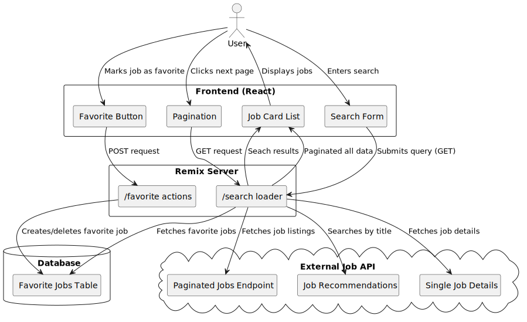

# Remix & Drizzle example

- 📖 [Remix docs](https://remix.run/docs)

## Set up

Install dependencies:

```shellscript
npm install
```

create SQLite database and run migrations:

```shellscript
npx drizzle-kit push
```

seed database:

```shellscript
npm run db:seed
```

Make sure that variables from `.env` are set - eg using `direnv`.

## Development

Run the dev server:

```shellscript
npm run dev
```

Seed file creates a single testing user. Login form is prefilled with the credentials.

## Deployment

First, build your app for production:

```sh
npm run build
```

Then run the app in production mode:

```sh
npm start
```

Now you'll need to pick a host to deploy it to.

### DIY

If you're familiar with deploying Node applications, the built-in Remix app server is production-ready.

Make sure to deploy the output of `npm run build`

- `build/server`
- `build/client`

## Architecture diagram

The Diagram was created using [PlantUML](https://plantuml.com/) in file `architecture.pulm`.


